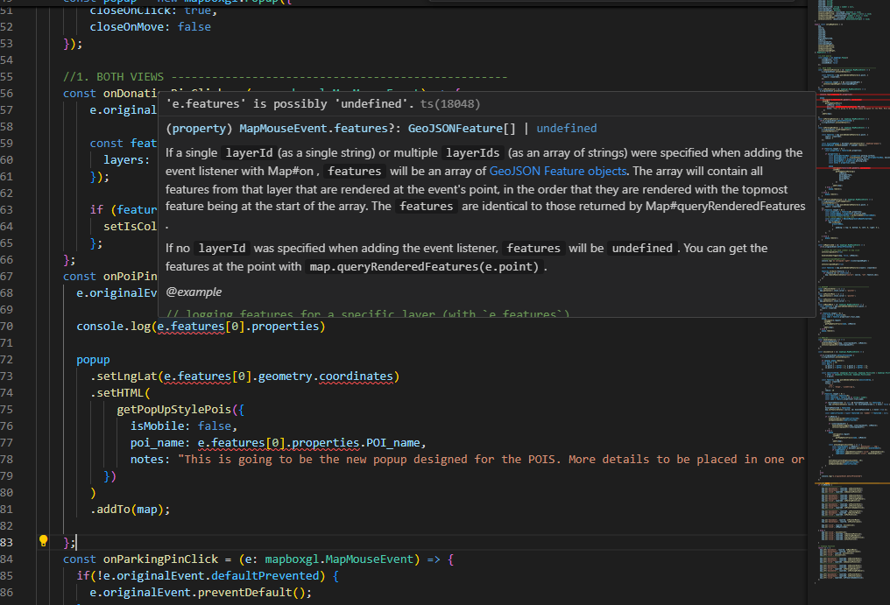
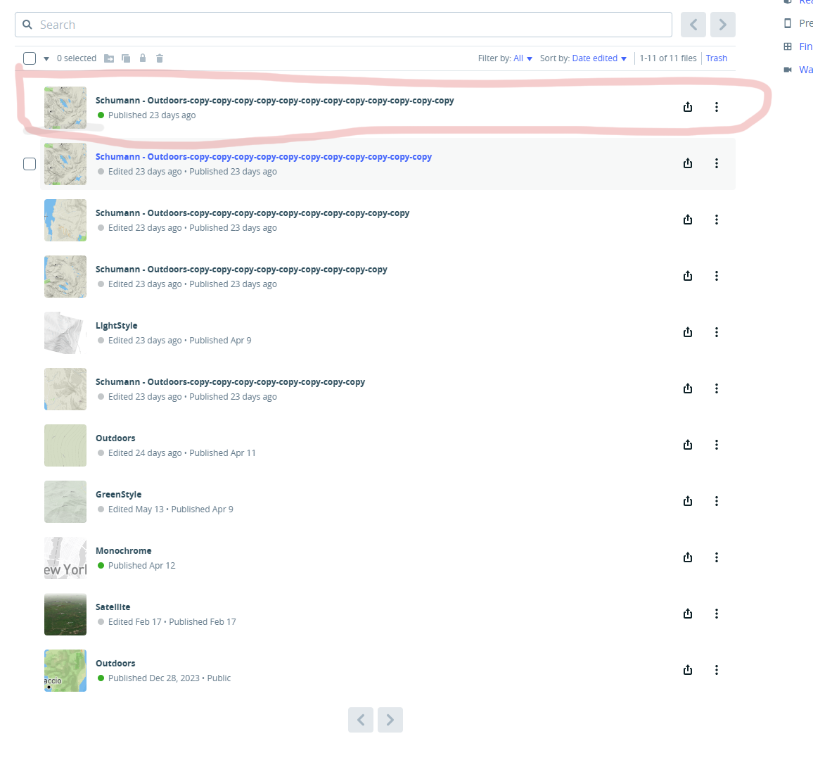

## GitHub Collaboration

- **Pull Requests (PRs):**  
    It would have been easier to review your changes if you had sent a PR. This helps prevent us from overwriting each other's work. For example, in your version, clicking the preserve pointer (yellow icons with preserve names) has stopped working. PRs are a great feature for multiple people working on the same codebase, allowing us to separate things and easier collaboration-something GitHub has supported for years.  
    If you’d like a video on how to send a PR, let me know-I'm happy to make one for you!

    
---

## Event Listeners

### `setupMapEvents.tsx`
- You created a new event listener function (`onPoiPinClick`) but didn't add it to the cleanup section. I have now addressed this in [`src/components/Events/TrailMap/setupMapEvents.tsx`].  
    Leaving it out causes multiple identical event listeners to be attached to the same layer when the component unmounts and mounts causing a memoryLeak or bug later on.  
    Since this will be a new map type, you can clean everything up and start from scratch in [`src/components/Events/WalkMap/setupMapEvents.tsx`] and include only the functions you need.
- **TypeScript Warnings:**  
    There are some TypeScript warnings in [`src/components/Events/WalkMap/setupMapEvents.tsx`], build on Vercel might fail, but put it to be less restrictive.
      
    
    
---

## Basemap
   - Comments:  why there are multiple styles  ? isn't the first one only used in the app ?
   

   - I think Ezra said that Outdoors style shouldn't be in the trail maps, so I cleaned it up and left it only in WalkMap Type
   
   - I cleaned up Basemap thing a bit - to avoid embedding configuration logic into helper functions. I created new dir styleExpression.ts [`src/components/Basemaps/TrailMap/styleExpressions.ts`]. I mean, great that you have incoporated your basemap here,  but I'm not sure if the new WalkMap type will need all the features like lineHighlight, etc.. so, moving forward, feel free to create configuration objects as needed, similar to how the current configs object works, if that makes things easier.

---

